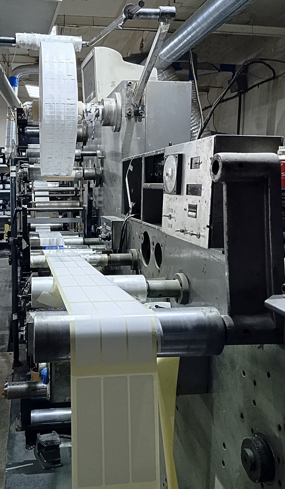
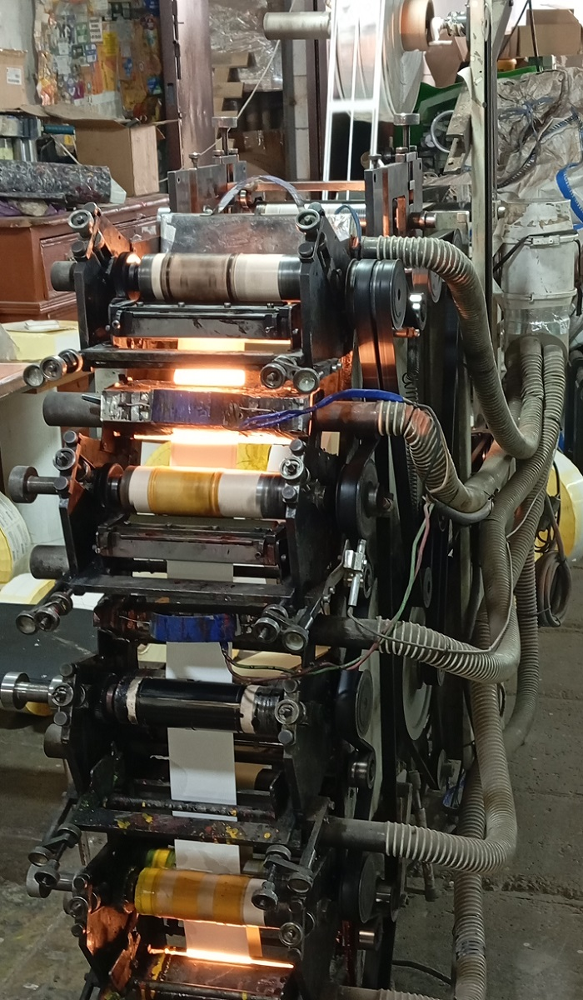
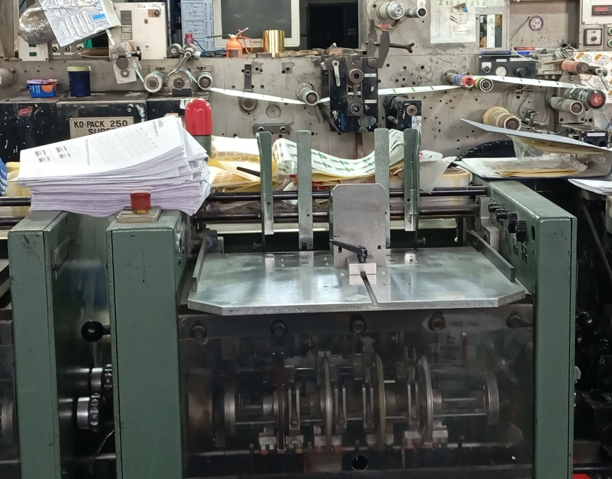

# Печать этикеток, наклеек, стикеров в Москве

!!! note "Печать наклеек, этикеток и стикеров на заказ"

    Изготовление и печать наклеек, стикеров в Москве предлагает онлайн-типография buystickers.ru. 
    Мы печатаем наклейки на пленке или самоклеющейся бумаге на профессиональном оборудовании. 
    Заказывайте изготовление наклеек прямо сейчас на сайте через онлайн форму.

  
<a href="tel:+79103331155" class="btn btn-primary phone_btn"><svg xmlns="http://www.w3.org/2000/svg" viewBox="0 0 24 24"><path d="M6.62 10.79c1.44 2.83 3.76 5.15 6.59 6.59l2.2-2.2c.28-.28.67-.36 1.02-.25 1.12.37 2.32.57 3.57.57a1 1 0 0 1 1 1V20a1 1 0 0 1-1 1A17 17 0 0 1 3 4a1 1 0 0 1 1-1h3.5a1 1 0 0 1 1 1c0 1.25.2 2.45.57 3.57.11.35.03.74-.25 1.02l-2.2 2.2Z"></path></svg>&nbsp;Позвонить</a>

  
<a href="https://wa.me/79103331155" class="btn btn-primary whatsapp_btn"><svg xmlns="http://www.w3.org/2000/svg" viewBox="0 0 448 512"><path d="M380.9 97.1C339 55.1 283.2 32 223.9 32c-122.4 0-222 99.6-222 222 0 39.1 10.2 77.3 29.6 111L0 480l117.7-30.9c32.4 17.7 68.9 27 106.1 27h.1c122.3 0 224.1-99.6 224.1-222 0-59.3-25.2-115-67.1-157zm-157 341.6c-33.2 0-65.7-8.9-94-25.7l-6.7-4-69.8 18.3L72 359.2l-4.4-7c-18.5-29.4-28.2-63.3-28.2-98.2 0-101.7 82.8-184.5 184.6-184.5 49.3 0 95.6 19.2 130.4 54.1 34.8 34.9 56.2 81.2 56.1 130.5 0 101.8-84.9 184.6-186.6 184.6zm101.2-138.2c-5.5-2.8-32.8-16.2-37.9-18-5.1-1.9-8.8-2.8-12.5 2.8-3.7 5.6-14.3 18-17.6 21.8-3.2 3.7-6.5 4.2-12 1.4-32.6-16.3-54-29.1-75.5-66-5.7-9.8 5.7-9.1 16.3-30.3 1.8-3.7 .9-6.9-.5-9.7-1.4-2.8-12.5-30.1-17.1-41.2-4.5-10.8-9.1-9.3-12.5-9.5-3.2-.2-6.9-.2-10.6-.2-3.7 0-9.7 1.4-14.8 6.9-5.1 5.6-19.4 19-19.4 46.3 0 27.3 19.9 53.7 22.6 57.4 2.8 3.7 39.1 59.7 94.8 83.8 35.2 15.2 49 16.5 66.6 13.9 10.7-1.6 32.8-13.4 37.4-26.4 4.6-13 4.6-24.1 3.2-26.4-1.3-2.5-5-3.9-10.5-6.6z"/></svg>&nbsp;Whatsapp</a>

  
<a href="tel:+79103331155" class="btn btn-primary send_btn"><svg xmlns="http://www.w3.org/2000/svg" viewBox="0 0 512 512"><path d="M64 112c-8.8 0-16 7.2-16 16l0 22.1L220.5 291.7c20.7 17 50.4 17 71.1 0L464 150.1l0-22.1c0-8.8-7.2-16-16-16L64 112zM48 212.2L48 384c0 8.8 7.2 16 16 16l384 0c8.8 0 16-7.2 16-16l0-171.8L322 328.8c-38.4 31.5-93.7 31.5-132 0L48 212.2zM0 128C0 92.7 28.7 64 64 64l384 0c35.3 0 64 28.7 64 64l0 256c0 35.3-28.7 64-64 64L64 448c-35.3 0-64-28.7-64-64L0 128z"/></svg>&nbsp;Прислать макет</a>

  
<a href="tel:+79103331155" class="btn btn-primary online_btn"><svg xmlns="http://www.w3.org/2000/svg" viewBox="0 0 576 512"><path d="M0 24C0 10.7 10.7 0 24 0L69.5 0c22 0 41.5 12.8 50.6 32l411 0c26.3 0 45.5 25 38.6 50.4l-41 152.3c-8.5 31.4-37 53.3-69.5 53.3l-288.5 0 5.4 28.5c2.2 11.3 12.1 19.5 23.6 19.5L488 336c13.3 0 24 10.7 24 24s-10.7 24-24 24l-288.3 0c-34.6 0-64.3-24.6-70.7-58.5L77.4 54.5c-.7-3.8-4-6.5-7.9-6.5L24 48C10.7 48 0 37.3 0 24zM128 464a48 48 0 1 1 96 0 48 48 0 1 1 -96 0zm336-48a48 48 0 1 1 0 96 48 48 0 1 1 0-96z"/></svg>&nbsp;Заказать онлайн</a>

- :fontawesome-solid-star: __Работаем 20 лет__ Большой опыт печати, большой выбор решений
- :fontawesome-solid-wallet: __Постоплата__ Любые способы оплаты и доставки
- :fontawesome-solid-money-bill-1: __Скидка на первый заказ__ У нас будет дешевле чем у конкурентов
- :fontawesome-solid-truck: __Несколько видов доставки__ Доставка курьером, авто и самовывоз

## Изготовление стикеров

{ width="150" align=left } 
Самоклеящиеся этикетки в сегодняшней торговле являются непременным и
обязательным атрибутом качественной маркировки любого товара, они предоставляют
покупателю полноценную информацию о происхождении, характеристиках изделий,
производителе, дате изготовления и составе продукции. Маркировка упаковки
стикерами при складском хранении, транспортировке значительно упрощает
идентификацию, контроль, оптимизирует логистические цепочки, повышая при этом
общую эффективность управления.

{ width="150" align=right } 
Основные требования к самоклеящимся этикеткам – информативность, стойкость к
неблагоприятным атмосферным воздействиям, долговечность. Стикеры являются
немаловажным фактором в маркетинге, презентабельности товара, узнаваемости
бренда. Самоклеящаяся этикетка объединяет в себе несколько слоев, основной слой,
изготавливается из фольги, картона, пленки, обычной бумаги и других материалов.
Клеевая основа зависит от области применения стикеров, подложка изготавливается
из прочной бумаги или из полиэтиленовой тонкой пленки. Предпочтительнее второй
вариант, полиэтилен более устойчив к повышенной влажности, температурным
перепадам, вредным химическим соединениям. Рулонные самоклеящиеся этикетки
просты в применении, с использованием аппаратов, аппликаторов для печати этикеток
на упаковке значительно экономят время при наклеивании. Рулон занимает намного
меньший объем при размещении на складе, транспортировке, в отличие от стопок
листов.

{ width="150" align=left } 
Наше предприятие давно и успешно занимается печатью этикеток для различных
сфер производства, ценников любой формы и размеров для розничной и оптовой
торговли. Печать этикеток достаточно сложный технологический процесс, состоящий
из нескольких производственных этапов на специальном профессиональном
оборудовании. Производственные мощности нашей специализированной типографии
рассчитаны на печать этикеток любого тиража.

Профессиональные специалисты окажут посильную помощь при выборе подходящего
дизайна стикеров, художественного оформления для размещения исчерпывающей
информации. Мы обеспечиваем эксклюзивную печать этикеток, разнообразных
красочных стикеров, цветных наклеек, изготавливаем всевозможную рекламную
продукцию с логотипами заказчика на технологичном полиграфическом оборудовании
в предельно сжатые сроки.

## Система оперативного размещения заказов

  > :fontawesome-solid-circle-chevron-right: С помощью удобного онлайн-калькулятора вы можете легко оформить заказ: рассчитать стоимость и сразу увидеть срок доставки. В одном окне формы собраны все шаги — добавление макета, указание контактов и оплата. Это просто и быстро!

  > :fontawesome-solid-circle-chevron-right:  После загрузки макета мы проводим его проверку на соответствие требованиям и при необходимости корректируем. Затем утверждаем с вами финальный вид продукции перед печатью.

  > :fontawesome-solid-circle-chevron-right:  Как только тираж будет готов, мы сразу же забираем его и доставляем вам. Мы избегаем хранения на складе и очередей доставок, чтобы вы получили свой заказ максимально быстро.

  
<a href="tel:+79103331155" class="btn btn-primary phone_btn"><svg xmlns="http://www.w3.org/2000/svg" viewBox="0 0 24 24"><path d="M6.62 10.79c1.44 2.83 3.76 5.15 6.59 6.59l2.2-2.2c.28-.28.67-.36 1.02-.25 1.12.37 2.32.57 3.57.57a1 1 0 0 1 1 1V20a1 1 0 0 1-1 1A17 17 0 0 1 3 4a1 1 0 0 1 1-1h3.5a1 1 0 0 1 1 1c0 1.25.2 2.45.57 3.57.11.35.03.74-.25 1.02l-2.2 2.2Z"></path></svg>&nbsp;Позвонить</a>

  
<a href="https://wa.me/79103331155" class="btn btn-primary whatsapp_btn"><svg xmlns="http://www.w3.org/2000/svg" viewBox="0 0 448 512"><path d="M380.9 97.1C339 55.1 283.2 32 223.9 32c-122.4 0-222 99.6-222 222 0 39.1 10.2 77.3 29.6 111L0 480l117.7-30.9c32.4 17.7 68.9 27 106.1 27h.1c122.3 0 224.1-99.6 224.1-222 0-59.3-25.2-115-67.1-157zm-157 341.6c-33.2 0-65.7-8.9-94-25.7l-6.7-4-69.8 18.3L72 359.2l-4.4-7c-18.5-29.4-28.2-63.3-28.2-98.2 0-101.7 82.8-184.5 184.6-184.5 49.3 0 95.6 19.2 130.4 54.1 34.8 34.9 56.2 81.2 56.1 130.5 0 101.8-84.9 184.6-186.6 184.6zm101.2-138.2c-5.5-2.8-32.8-16.2-37.9-18-5.1-1.9-8.8-2.8-12.5 2.8-3.7 5.6-14.3 18-17.6 21.8-3.2 3.7-6.5 4.2-12 1.4-32.6-16.3-54-29.1-75.5-66-5.7-9.8 5.7-9.1 16.3-30.3 1.8-3.7 .9-6.9-.5-9.7-1.4-2.8-12.5-30.1-17.1-41.2-4.5-10.8-9.1-9.3-12.5-9.5-3.2-.2-6.9-.2-10.6-.2-3.7 0-9.7 1.4-14.8 6.9-5.1 5.6-19.4 19-19.4 46.3 0 27.3 19.9 53.7 22.6 57.4 2.8 3.7 39.1 59.7 94.8 83.8 35.2 15.2 49 16.5 66.6 13.9 10.7-1.6 32.8-13.4 37.4-26.4 4.6-13 4.6-24.1 3.2-26.4-1.3-2.5-5-3.9-10.5-6.6z"/></svg>&nbsp;Whatsapp</a>

  
<a href="tel:+79103331155" class="btn btn-primary send_btn"><svg xmlns="http://www.w3.org/2000/svg" viewBox="0 0 512 512"><path d="M64 112c-8.8 0-16 7.2-16 16l0 22.1L220.5 291.7c20.7 17 50.4 17 71.1 0L464 150.1l0-22.1c0-8.8-7.2-16-16-16L64 112zM48 212.2L48 384c0 8.8 7.2 16 16 16l384 0c8.8 0 16-7.2 16-16l0-171.8L322 328.8c-38.4 31.5-93.7 31.5-132 0L48 212.2zM0 128C0 92.7 28.7 64 64 64l384 0c35.3 0 64 28.7 64 64l0 256c0 35.3-28.7 64-64 64L64 448c-35.3 0-64-28.7-64-64L0 128z"/></svg>&nbsp;Прислать макет</a>

  
<a href="tel:+79103331155" class="btn btn-primary online_btn"><svg xmlns="http://www.w3.org/2000/svg" viewBox="0 0 576 512"><path d="M0 24C0 10.7 10.7 0 24 0L69.5 0c22 0 41.5 12.8 50.6 32l411 0c26.3 0 45.5 25 38.6 50.4l-41 152.3c-8.5 31.4-37 53.3-69.5 53.3l-288.5 0 5.4 28.5c2.2 11.3 12.1 19.5 23.6 19.5L488 336c13.3 0 24 10.7 24 24s-10.7 24-24 24l-288.3 0c-34.6 0-64.3-24.6-70.7-58.5L77.4 54.5c-.7-3.8-4-6.5-7.9-6.5L24 48C10.7 48 0 37.3 0 24zM128 464a48 48 0 1 1 96 0 48 48 0 1 1 -96 0zm336-48a48 48 0 1 1 0 96 48 48 0 1 1 0-96z"/></svg>&nbsp;Заказать онлайн</a>

# Нам доверяют

<!-- Галерея для десктопа  -->

  

  

  

  

  

<!-- Слайдер для мобильной версии -->

  

    

    

    

    

    

  

  <button class="slider-prev">&#10094;</button>
  <button class="slider-next">&#10095;</button>

