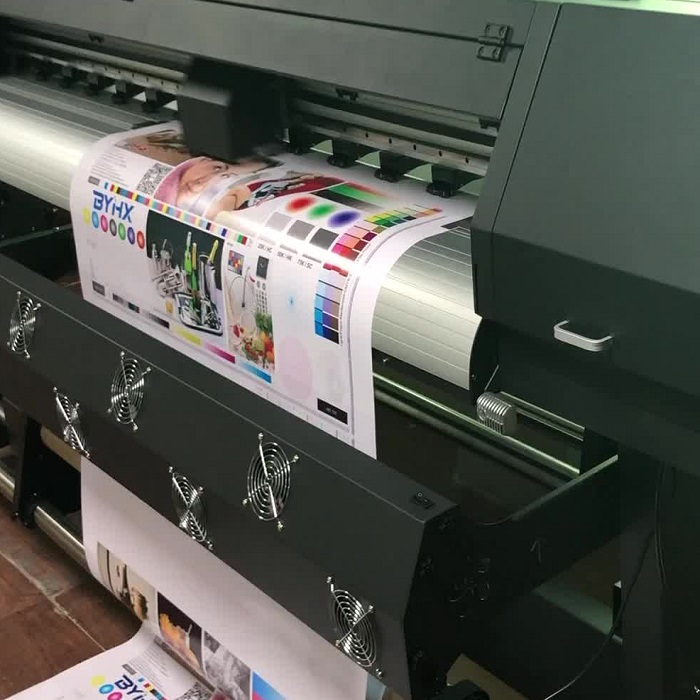
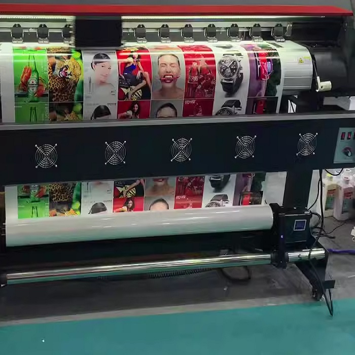

# Глянцевая пленка

## Печать на самоклеящейся пленке

Печать на глянцевой пленке является особенно востребованной актуальной
рекламной продукцией по вполне понятным причинам. Глянцевая самоклеящаяся
пленка весьма прочная, практически не выцветает под прямыми солнечными лучами,
прекрасно отражает свет, привлекает внимание интенсивными красками, яркостью и
контрастностью изображения. 

Наносится на поверхности разной геометрической
формы – выпуклые, угловатые, вогнутые, простая при раскройке, резке, легко
растягивается, обладает повышенной стойкостью к температурным скачкам,
влагонепроницаемая, противодействует вредным химическим элементам. Для
долговечности, дополнительной защиты от физических повреждений – царапин,
ссадин и преждевременного износа, в процессе печати на глянцевой пленке иногда
применяется ламинирование материала.

Область использования глянцевой пленки довольно широка – для этикеток, наклеек в
торговой индустрии, оформления красочных витрин, презентабельных стендов,
создания эффектной рекламы на автотрассах, транспорте. Печать на глянцевой пленке
сразу бросается в глаза при посещении объектов сферы услуг, культурных,
искусствоведческих, образовательных учреждений. Глянцевая самоклеящаяся пленка
используется при декорировании помещений, внутреннего и внешнего пространства
магазинов, ярмарок, выставочных центров. Широкоформатная печать на глянцевой
пленке дает возможность изготавливать оригинальные постеры – гораздо более
дешевый вариант, в отличие от фотообоев, для создания уютного, неповторимого
интерьера в жилом пространстве. При проведении монтажных работ, наклеивания на
жесткую основу не требуется тщательная обработка поверхности.

Предлагаем печать на глянцевой пленке с непревзойденным качеством оформления
по предварительно согласованному проекту с участием наших
высококвалифицированных дизайнеров с применением инновационных материалов.
Глянцевая пленка в Москве и Московской области по умеренным ценам представлена
в полиграфическом объединении ТППАК, осуществляем нанесение крайне
реалистичного, сочного изображения с высокой степенью защиты от внешних
неблагоприятных факторов воздействия.

[:material-phone: Позвонить и заказать печать на самоклеющейся пленке]( tel:+79103331155 ){ .md-button .md-button--primary }