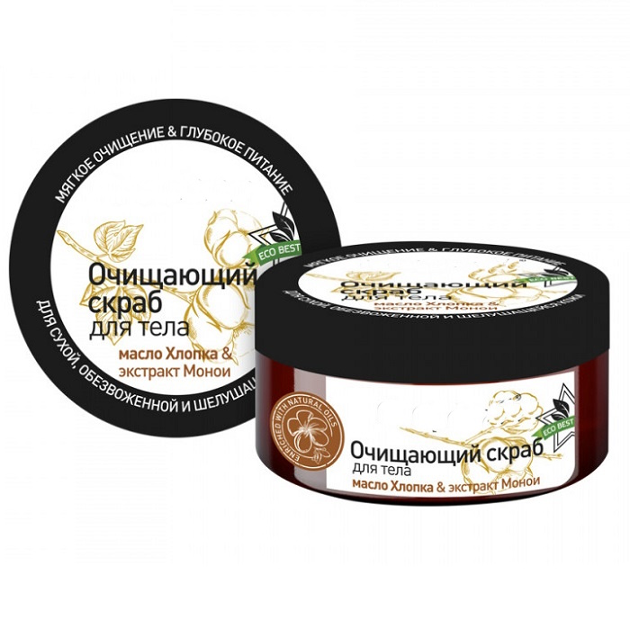
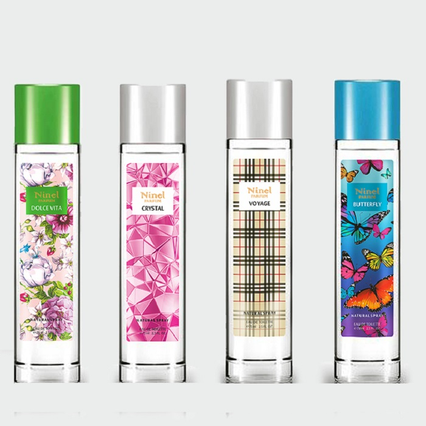

# Этикетки для косметики

  
<a href="tel:+79103331155" class="btn btn-primary phone_btn"><svg xmlns="http://www.w3.org/2000/svg" viewBox="0 0 24 24"><path d="M6.62 10.79c1.44 2.83 3.76 5.15 6.59 6.59l2.2-2.2c.28-.28.67-.36 1.02-.25 1.12.37 2.32.57 3.57.57a1 1 0 0 1 1 1V20a1 1 0 0 1-1 1A17 17 0 0 1 3 4a1 1 0 0 1 1-1h3.5a1 1 0 0 1 1 1c0 1.25.2 2.45.57 3.57.11.35.03.74-.25 1.02l-2.2 2.2Z"></path></svg>&nbsp;Позвонить</a>

  
<a href="https://wa.me/79103331155" class="btn btn-primary whatsapp_btn"><svg xmlns="http://www.w3.org/2000/svg" viewBox="0 0 448 512"><path d="M380.9 97.1C339 55.1 283.2 32 223.9 32c-122.4 0-222 99.6-222 222 0 39.1 10.2 77.3 29.6 111L0 480l117.7-30.9c32.4 17.7 68.9 27 106.1 27h.1c122.3 0 224.1-99.6 224.1-222 0-59.3-25.2-115-67.1-157zm-157 341.6c-33.2 0-65.7-8.9-94-25.7l-6.7-4-69.8 18.3L72 359.2l-4.4-7c-18.5-29.4-28.2-63.3-28.2-98.2 0-101.7 82.8-184.5 184.6-184.5 49.3 0 95.6 19.2 130.4 54.1 34.8 34.9 56.2 81.2 56.1 130.5 0 101.8-84.9 184.6-186.6 184.6zm101.2-138.2c-5.5-2.8-32.8-16.2-37.9-18-5.1-1.9-8.8-2.8-12.5 2.8-3.7 5.6-14.3 18-17.6 21.8-3.2 3.7-6.5 4.2-12 1.4-32.6-16.3-54-29.1-75.5-66-5.7-9.8 5.7-9.1 16.3-30.3 1.8-3.7 .9-6.9-.5-9.7-1.4-2.8-12.5-30.1-17.1-41.2-4.5-10.8-9.1-9.3-12.5-9.5-3.2-.2-6.9-.2-10.6-.2-3.7 0-9.7 1.4-14.8 6.9-5.1 5.6-19.4 19-19.4 46.3 0 27.3 19.9 53.7 22.6 57.4 2.8 3.7 39.1 59.7 94.8 83.8 35.2 15.2 49 16.5 66.6 13.9 10.7-1.6 32.8-13.4 37.4-26.4 4.6-13 4.6-24.1 3.2-26.4-1.3-2.5-5-3.9-10.5-6.6z"/></svg>&nbsp;Whatsapp</a>

  
<a href="tel:+79103331155" class="btn btn-primary send_btn"><svg xmlns="http://www.w3.org/2000/svg" viewBox="0 0 512 512"><path d="M64 112c-8.8 0-16 7.2-16 16l0 22.1L220.5 291.7c20.7 17 50.4 17 71.1 0L464 150.1l0-22.1c0-8.8-7.2-16-16-16L64 112zM48 212.2L48 384c0 8.8 7.2 16 16 16l384 0c8.8 0 16-7.2 16-16l0-171.8L322 328.8c-38.4 31.5-93.7 31.5-132 0L48 212.2zM0 128C0 92.7 28.7 64 64 64l384 0c35.3 0 64 28.7 64 64l0 256c0 35.3-28.7 64-64 64L64 448c-35.3 0-64-28.7-64-64L0 128z"/></svg>&nbsp;Прислать макет</a>

## Наклейки для косметических товаров
{ width="200" align=left } 
Этикетки для косметики с безупречным внешним видом, исчерпывающей
информацией играют определяющую роль в привлечении интереса перспективных
покупателей. Основная задача наклейки для косметических товаров – выделиться из
ассортимента аналогичной продукции, сформировать безусловное положительное
впечатление у потребителя при первом знакомстве с брендом, вызвать эмоциональный
отклик при визуальном контакте. Важные аспекты в продвижении товара –
информационная насыщенность с указанием рекомендаций по использованию,
противодействие фальсификации, привлекательный яркий логотип, четкое
наименование, состав косметических товаров, другие практические сведения.

При печати этикеток для косметики следует соблюдать несколько принципиальных
правил. Наклейки для косметических товаров должны обладать резистентностью к
внешним пагубным воздействиям в виде повышенной влаги, пыли, температурным
колебаниям, исключать выцветание под влиянием ультрафиолета. Важен выбор
надежного клеевого состава, стойкой краски, подбор вида печати этикетки для
косметики. К основным видам косметических средств относятся всевозможные кремы,
шампуни, масла, лосьоны, одеколоны, кондиционеры, помада, румяна, различные
сыворотки, тени. Мы предлагаем листовую и рулонную печать этикеток для
косметики и парфюмерной продукции с глянцевым, матовым покрытием,
самоклеящиеся, прозрачные и полупрозрачные самоклейки. Также для изготовления
наклеек для косметических товаров мы используем термопластичные полимеры,
полиэстер, обычную и термобумагу, другие синтетические материалы.

{ width="200" align=right }
### Методы печати этикеток для косметики и парфюмерной продукции.

Флексография позволяет перенести полноцветные красочные изображения на самые
разнообразные материалы большими тиражами, дополнительно возможна ламинация,
нанесение голографических элементов, тиснение, покрытие лаком..
Цифровая печать предназначена для печати ограниченного объема бумажной
продукции.

Термотрансферный метод подойдет для флаконов, соседствующих с химически
активной средой.

Офсетная печать позволяет изготовить многоразовые многослойные книжечки-
раскладушки с предоставлением максимума информации.
Печать этикеток для косметики и парфюмерии требует компетентного подхода и
высокой квалификации специалистов, мы можем предложить услуги
высокопрофессиональных дизайнеров и наше современное оборудование для
воплощения креативных идей при изготовлении этикетки для косметики и
парфюмерии в Москве.