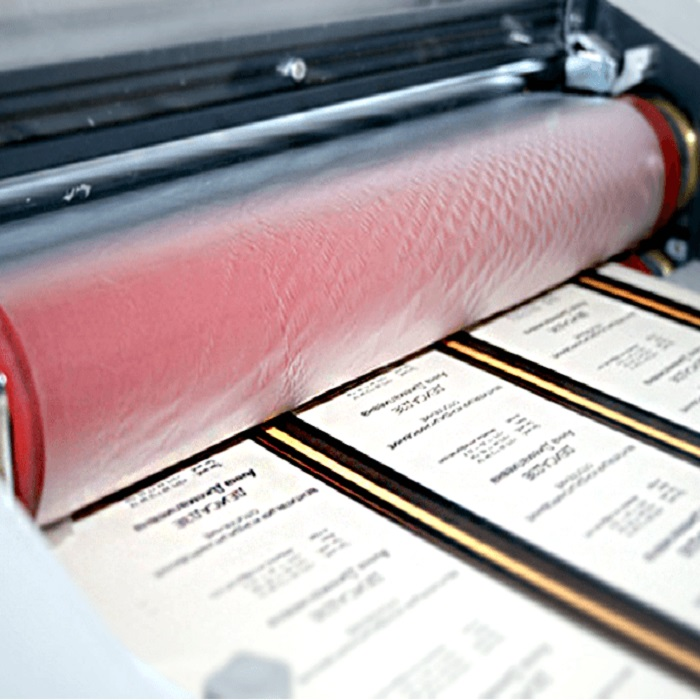
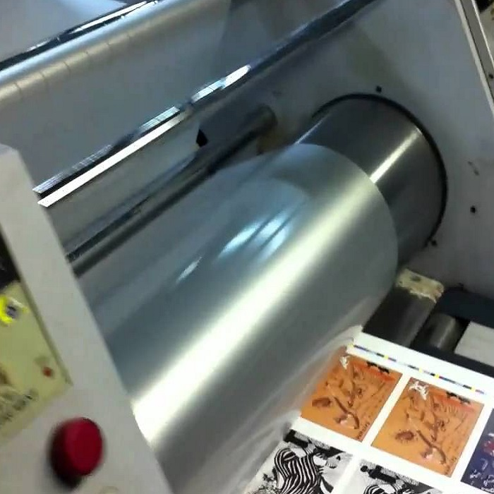

# Ламинирование этикеток

  
<a href="tel:+79103331155" class="btn btn-primary phone_btn"><svg xmlns="http://www.w3.org/2000/svg" viewBox="0 0 24 24"><path d="M6.62 10.79c1.44 2.83 3.76 5.15 6.59 6.59l2.2-2.2c.28-.28.67-.36 1.02-.25 1.12.37 2.32.57 3.57.57a1 1 0 0 1 1 1V20a1 1 0 0 1-1 1A17 17 0 0 1 3 4a1 1 0 0 1 1-1h3.5a1 1 0 0 1 1 1c0 1.25.2 2.45.57 3.57.11.35.03.74-.25 1.02l-2.2 2.2Z"></path></svg>&nbsp;Позвонить</a>

  
<a href="https://wa.me/79103331155" class="btn btn-primary whatsapp_btn"><svg xmlns="http://www.w3.org/2000/svg" viewBox="0 0 448 512"><path d="M380.9 97.1C339 55.1 283.2 32 223.9 32c-122.4 0-222 99.6-222 222 0 39.1 10.2 77.3 29.6 111L0 480l117.7-30.9c32.4 17.7 68.9 27 106.1 27h.1c122.3 0 224.1-99.6 224.1-222 0-59.3-25.2-115-67.1-157zm-157 341.6c-33.2 0-65.7-8.9-94-25.7l-6.7-4-69.8 18.3L72 359.2l-4.4-7c-18.5-29.4-28.2-63.3-28.2-98.2 0-101.7 82.8-184.5 184.6-184.5 49.3 0 95.6 19.2 130.4 54.1 34.8 34.9 56.2 81.2 56.1 130.5 0 101.8-84.9 184.6-186.6 184.6zm101.2-138.2c-5.5-2.8-32.8-16.2-37.9-18-5.1-1.9-8.8-2.8-12.5 2.8-3.7 5.6-14.3 18-17.6 21.8-3.2 3.7-6.5 4.2-12 1.4-32.6-16.3-54-29.1-75.5-66-5.7-9.8 5.7-9.1 16.3-30.3 1.8-3.7 .9-6.9-.5-9.7-1.4-2.8-12.5-30.1-17.1-41.2-4.5-10.8-9.1-9.3-12.5-9.5-3.2-.2-6.9-.2-10.6-.2-3.7 0-9.7 1.4-14.8 6.9-5.1 5.6-19.4 19-19.4 46.3 0 27.3 19.9 53.7 22.6 57.4 2.8 3.7 39.1 59.7 94.8 83.8 35.2 15.2 49 16.5 66.6 13.9 10.7-1.6 32.8-13.4 37.4-26.4 4.6-13 4.6-24.1 3.2-26.4-1.3-2.5-5-3.9-10.5-6.6z"/></svg>&nbsp;Whatsapp</a>

  
<a href="tel:+79103331155" class="btn btn-primary send_btn"><svg xmlns="http://www.w3.org/2000/svg" viewBox="0 0 512 512"><path d="M64 112c-8.8 0-16 7.2-16 16l0 22.1L220.5 291.7c20.7 17 50.4 17 71.1 0L464 150.1l0-22.1c0-8.8-7.2-16-16-16L64 112zM48 212.2L48 384c0 8.8 7.2 16 16 16l384 0c8.8 0 16-7.2 16-16l0-171.8L322 328.8c-38.4 31.5-93.7 31.5-132 0L48 212.2zM0 128C0 92.7 28.7 64 64 64l384 0c35.3 0 64 28.7 64 64l0 256c0 35.3-28.7 64-64 64L64 448c-35.3 0-64-28.7-64-64L0 128z"/></svg>&nbsp;Прислать макет</a>

  
<a href="tel:+79103331155" class="btn btn-primary online_btn"><svg xmlns="http://www.w3.org/2000/svg" viewBox="0 0 576 512"><path d="M0 24C0 10.7 10.7 0 24 0L69.5 0c22 0 41.5 12.8 50.6 32l411 0c26.3 0 45.5 25 38.6 50.4l-41 152.3c-8.5 31.4-37 53.3-69.5 53.3l-288.5 0 5.4 28.5c2.2 11.3 12.1 19.5 23.6 19.5L488 336c13.3 0 24 10.7 24 24s-10.7 24-24 24l-288.3 0c-34.6 0-64.3-24.6-70.7-58.5L77.4 54.5c-.7-3.8-4-6.5-7.9-6.5L24 48C10.7 48 0 37.3 0 24zM128 464a48 48 0 1 1 96 0 48 48 0 1 1 -96 0zm336-48a48 48 0 1 1 0 96 48 48 0 1 1 0-96z"/></svg>&nbsp;Заказать онлайн</a>

## Наклейки с ламинирующим слоем
Ламинирование находит широкое применение при печати этикеток, эстампов,
плакатов, буклетов, всевозможных визиток, бейджей, календарей, приглашений,
календарей и многого другого. Ламинированные этикетки покрыты специальным
составом, оберегающим наклейку от негативных, неблагоприятных и пагубных
факторов воздействия, включая химические составы, вредное ультрафиолетовое
излучение, повышенное влагосодержание, пыль, загрязнения.

{ width="200" align=left } 
Наш полиграфический современный комплекс предлагает ламинирование в Москве и
Московской области этикеток с высочайшим качеством производства сольвентным
или бессольветным способом на профессиональном ламинаторе. Ширина
ламинирования бумаги, иных материалов до 800 мм со скоростью до 300 метров в
минуту, для крупных партий рекомендуем рулонное производство.

Для пленочного покрытия печатной продукции как правило применяют в
зависимости от назначения глянцевую или матовую пленку. Глянцевая при
ламинировании бумаги, полимеров формирует четкую цветопередачу, яркость красок,
насыщенность, придает совершенный блеск и является чрезвычайно популярной.
Матовая пленка в процессе ламинирования этикеток, другой продукции исключает
отсвечивание, появление бликов, способствует лучшему восприятию текста, создает
эффект легкой шершавости поверхности, весьма приятной при соприкосновении с
руками. Для увеличения продолжительности службы наклеек применяется
двустороннее нанесение пленочного покрытия.

{ width="200" align=right }
Ламинирование этикеток достаточно трудоемкий непростой процесс, требующий
высокой квалификации и наличия ламинатора. Процесс сольвентного нанесения
защитного покрытия включает в себя нанесение клеящего состава с растворителем на
поверхность с последующим этапом сушки в специальной камере с улетучиванием
компонентов растворителя. Бессольвентное ламинирование этикеток из БОПП, ПЭТ,
бумаги, полиэтилена, фольги намного экологичнее, подразумевает использование
одно и многокомпонентного клея без растворителя. Недостаток этого метода
заключается в невозможности использования упаковки при высокотемпературных
режимах.
Мы предлагаем ламинирование бумаги и других материалов в Московской области и
Москве по приемлемой цене и без промедления на высококачественном ламинаторе,
полученное защитное покрытие полностью удовлетворит заказчика.